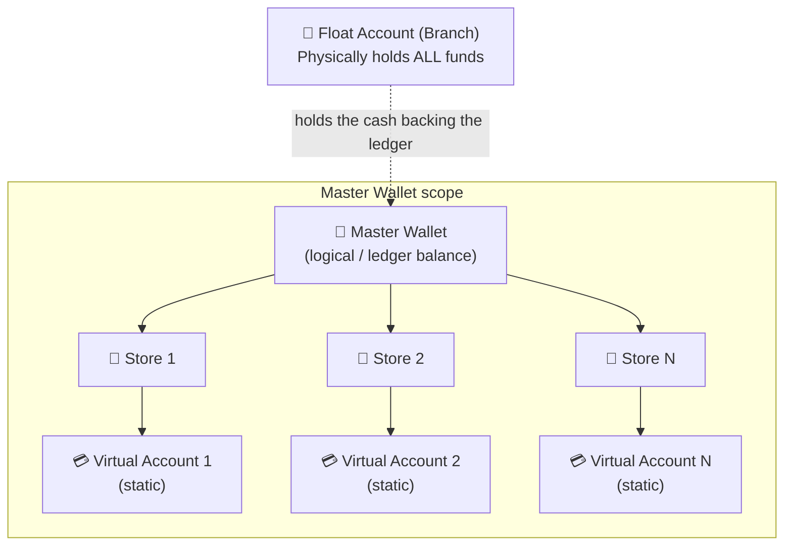
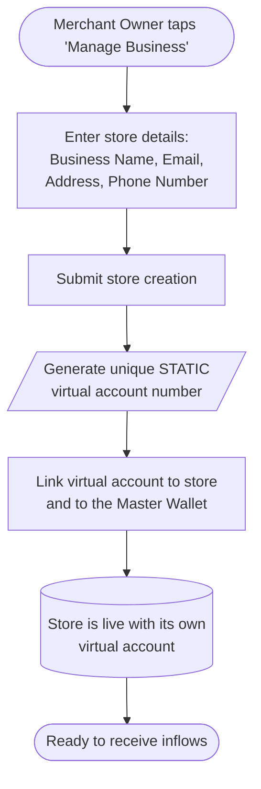
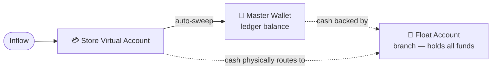

# Auto-Sweep — Fund Flow Architecture & Flowchart

> **Scope note:** The *Retain in Store Wallet* mode has been removed. **Auto-Sweep is now the
> single, only fund-flow behaviour**, so there is no longer a "Fund Flow Mode" selector at store
> creation or on the master dashboard. All store inflows always sweep up to the Master Wallet.

---

## 1. Account Hierarchy

- **Float Account (Branch):** the single, larger account that **physically holds all funds** for
  every master and every store underneath it.
- **Master Wallet (under the Float):** the merchant owner's wallet. It reflects a **logical / ledger
  balance** — the money it "owns" actually lives in the Float Account.
- **Stores:** a Master Wallet can create **many stores**. Each store is provisioned with its own
  **static virtual account number** at creation.

---

## 2. Store Creation Flow

> Compared with the original BPRD, the **"Select Fund Flow Mode"** step has been **dropped** from
> store creation. Every store is created in Auto-Sweep behaviour by default.

---

## 3. Auto-Sweep Fund Flow (Inflow)

```mermaid
flowchart TD
    Start([Customer / payer initiates an inflow]) --> Pay[Payment sent to the<br/>STORE's static virtual account]
    Pay --> Land[Funds land in the<br/>Store Virtual Account]
    Land --> Sweep{{Auto-Sweep<br/>triggered automatically}}

    Sweep --> Ledger[Credit the Master Wallet<br/>logical / ledger balance]
    Sweep --> Pool[Cash is pooled into the<br/>Float Account &#40;branch&#41;]

    Ledger --> Tag[Record store-level breakdown<br/>so owner sees per-store inflow]
    Pool --> Hold[(Float Account holds the<br/>actual money for all masters)]

    Tag --> Dash[Master dashboard reflects<br/>updated wallet balance]
    Hold --> Dash

    Dash --> End([Owner views total balance<br/>+ per-store contribution])

    %% There is no decision on fund-flow mode and no 'retain in store' branch.
```

### What changed from the original design

| Item | Before (BPRD v1.0) | After (this change) |
| --- | --- | --- |
| Fund Flow Modes | Two: *Auto-Sweep* **and** *Retain in Store Wallet* | **One: Auto-Sweep only** |
| Mode selector at store creation | Required | **Removed** |
| Mode toggle on master dashboard | Required | **Removed** |
| Store Manager outbound transfer (PIN) | Enabled when *Retain in Store* | **N/A** — removed with the mode |
| Where funds settle | Store wallet *or* master, depending on mode | Always swept up to **Master Wallet**, cash held in **Float** |
| Where cash physically sits | Store/master wallet | **Float Account (branch)** for everyone |

---

## 4. End-to-End Summary (single view)

**Plain-language flow:** an inflow hits the **store's virtual account** → it is **auto-swept** so the
**Master Wallet** balance goes up → the actual money is **held in the Float Account** (the branch)
which pools the funds for every master and store beneath it. There is **only one** fund-flow path.
